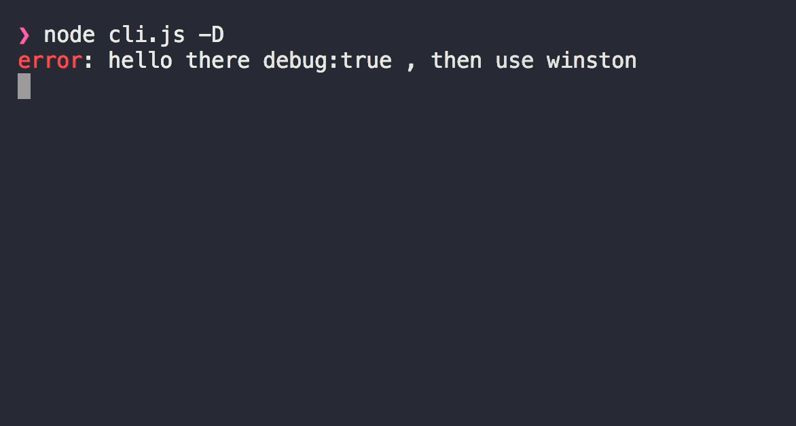

# two-log [](https://travis-ci.org/chinanf-boy/two-log) [](https://codecov.io/gh/chinanf-boy/two-log?branch=master) [](https://github.com/chinanf-boy/two-log-explain)

> switch `ora` and `winston` , if `debug == true` log => `winston`, else log => `ora`

## DEMO

```
npm i -g two-log
```

<p>


</p>

## Usage

```js
// cli.js
const twoLog = require('two-log');
let D = cli.flags['D'] ? true : false;

let l = twoLog(D);

let useWhat = !D ? 'ora' : 'winston';

l.start(`hello there debug:${D} , then use ${useWhat}`, {
	ora: 'red',
	log: 'error',
});

let t = 5000;

setTimeout(() => {
	l.text(`ora:green, log:debug and ${t} i will stop `, {
		ora: 'green',
	});

	l.one('just show one time ora');
}, t - 3000);

setTimeout(() => {
	l.text(`ora:green, log:debug and ${t} only show log style `, {
		ora: 'green',
		only: 'log',
	});
}, t - 2000);

setTimeout(() => {
	l.stop(`${t}ms , ok i fail if ora `, { ora: 'fail', log: 'debug' });
}, t);
```

### l.start === loggerStart

### l.text === loggerText

### l.stop === loggerStop

### l.one === oneOra

> logger`***` use for other module without `l = twoLog(D)` init

---

## API

### twoLog(debug, userUser):log

#### debug

| name: | debug             |
| ----- | ----------------- |
| Type: | `boolean`         |
| Desc: | debug for two log |

#### userUse(api)

| name:    | userUse                        |
| -------- | ------------------------------ |
| Type:    | `function(api)`                |
| Default: | `undefined`                    |
| Desc:    | reset winston options for user |

##### api

| name:       | api             |
| ----------- | --------------- |
| Type:       | `object`        |
| Desc:       | api for user    |
| api.log:    | log === winston |
| api.setLog: | winston options |

<details>

<summary>
api examples
</summary>

```js
let userUse = api => {
	let winston = api.log;
	let wopts = {
		level: 'info',
	};
	api.setLog(wopts);
};

let l = log(true, userUse);
// winston level change
```

two-log default winston options

```js
let defaultWinston = {
	level: 'debug',
	transports: [
		new winston.transports.Console({
			datePattern: '.yyyy-MM-ddTHH-mm',
			colorize: true,
		}),
		new winston.transports.File({
			filename: `${pkg.name}.log`,
			handleExceptions: true,
			maxsize: 52000,
			maxFiles: 1,
			level: 'info',
			colorize: true,
		}),
	],
};
```

</details>

---

### log

| name:    | log                     |
| -------- | ----------------------- |
| Type:    | `any`                   |
| Desc:    | log api                 |
| Default: | `{ start, text, stop }` |
| Details: | `start === loggerStart` |
| Details: | `text === loggerText`   |
| Details: | `stop === loggerStop`   |
| Details: | `one === oneOra`        |

---

### loggerStart(str, options)

#### str

| name: | str      |
| ----- | -------- |
| Type: | `string` |
| Desc: | log text |

#### options

| name:         | options                                    |
| ------------- | ------------------------------------------ |
| Type:         | `any`                                      |
| Default:      | `{ ora: 'yellow', log: 'debug', only:"" }` |
| Desc:         | log text                                   |
| options.ora:  | ora color                                  |
| options.log:  | winston show log level                     |
| options.only: | only one {'ora' \| 'log'} can use          |

### loggerText(str, options)

#### str

| name: | str      |
| ----- | -------- |
| Type: | `string` |
| Desc: | log text |

#### options

| name:         | options                                    |
| ------------- | ------------------------------------------ |
| Type:         | `any`                                      |
| Default:      | `{ ora: 'yellow', log: 'debug', only:"" }` |
| Desc:         | log text                                   |
| options.ora:  | ora color                                  |
| options.log:  | winston show log level                     |
| options.only: | only one {'ora' \| 'log'} can use          |

### loggerStop(str, options)

#### str

| name: | str      |
| ----- | -------- |
| Type: | `string` |
| Desc: | log text |

#### options

| name:         | options                                                                  |
| ------------- | ------------------------------------------------------------------------ |
| Type:         | `any`                                                                    |
| Default:      | `{ ora: '', log: 'debug', only:"" }`                                     |
| Desc:         | log text                                                                 |
| options.ora:  | ora {`fail\|succeed\|warn`} https://github.com/sindresorhus/ora#instance |
| options.log:  | winston show log level                                                   |
| options.only: | only one {'ora' \| 'log'} can use                                        |

### oneOra(str, options)

#### str

| name: | str      |
| ----- | -------- |
| Type: | `string` |
| Desc: | ora text |

#### options

| name:          | options                                                                  |
| -------------- | ------------------------------------------------------------------------ |
| Type:          | `any`                                                                    |
| Default:       | `{ color: 'yellow', end: 'succeed' }`                                    |
| Desc:          | log text                                                                 |
| options.end:   | end {`fail\|succeed\|warn`} https://github.com/sindresorhus/ora#instance |
| options.color: | color                                                                    |

---

## CLI

> just Demo

```
npm install --global two-log
```

```
$ two-log --help

	Usage
	  $ two-log -D

	Options
	  -D  Debug [Default: false]

	Examples
	  $ two-log
	  ora show
	  $ two-log -D
	  winston show
```

## use by

- [node-modules-size](https://github.com/chinanf-boy/node-modules-size) show node_modules hole size
- [doc-templite](https://github.com/chinanf-boy/doc-templite) multi-md-file with templite tool

## License

MIT © [chinanf-boy](http://llever.com)
